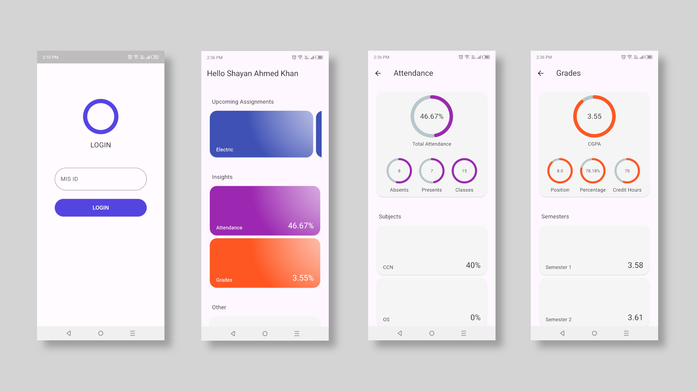

# Section A - Student Statistics App

This mobile application empowers students enrolled in Section A at Federal Urdu University to manage their academic lives effectively. It provides a centralized platform for students to access and visualize all their crucial academic data, fostering a sense of ownership over their educational journeys.

## Preview

## Features

### Real-time Grade Tracking:
View your grades for all courses in a clear and user-friendly format.

### Attendance Monitoring:
Stay informed about your attendance for each course, allowing for communication with instructors if necessary.

### Upcoming Assignment Reminders:
Never miss a deadline with a comprehensive list of upcoming assignments displayed for each course.

### Clear Class Timetable:
Easily access your class schedule to stay organized and manage your time effectively.

## Getting Started

1. Clone the repository: `git clone https://github.com/your-username/section-a-app.git`

2. Install dependencies: `flutter pub get`

4. Run the app: `flutter run -d [deviceID]`

## License:

This project is licensed under the MIT License (see the LICENSE file for details).
